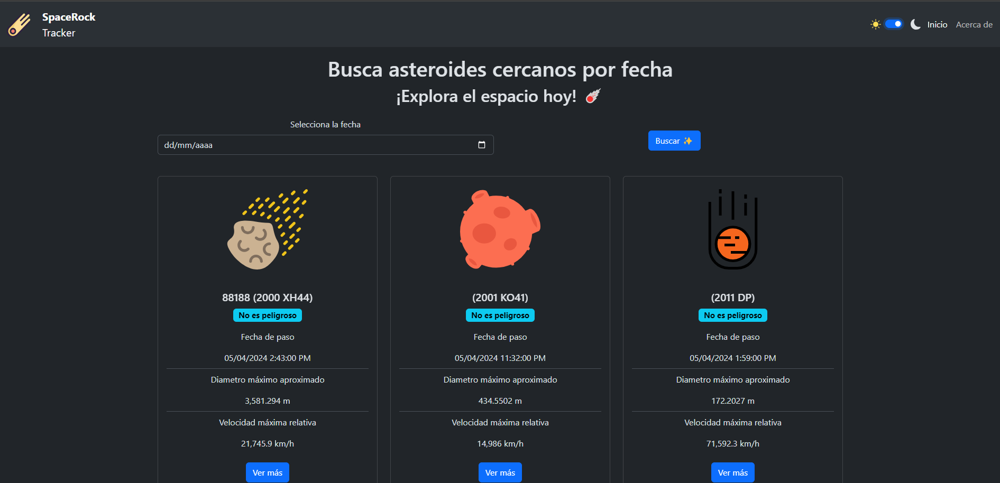

# NasaApp
[Live demo](https://spacerocktracker.netlify.app/about)

     
Aplicación que permite buscar asteroides cercanos a la Tierra usando la API de la NASA llamada "NeoWs" (Near Earth Object Web Service).
[API NASA](https://api.nasa.gov/)

Se uso para el desarrollo las siguientes tegnologias
-  Angular 17
-  RXJS
-  Typescript
-  Boostrap

Se aplicaron los siguientes conceptos
- Lazy load
- Uso de Observables para obtener información de una API
- Uso de servicios para el tema de color y para la persistencia de datos

